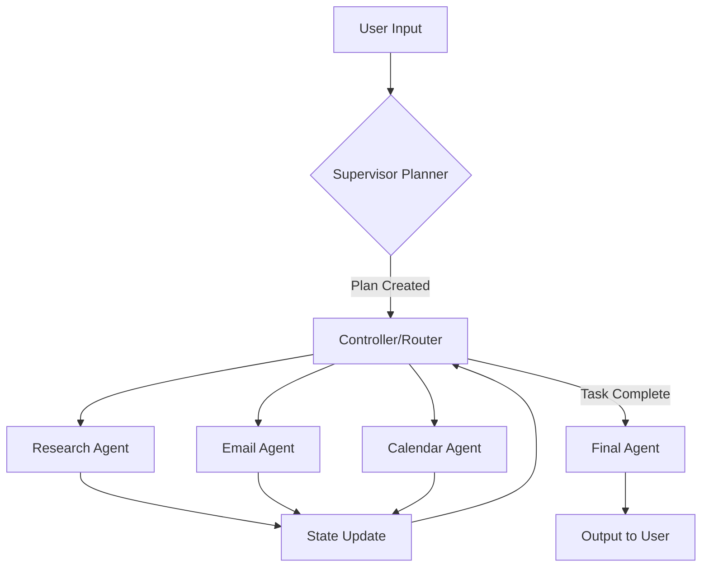

# SwarmAI: Technical Interview Guide & Workflow

This document provides a deep dive into the architecture, technical decisions, and execution workflow of the SwarmAI project. Use this as a reference to explain the project during your interview.

---

## 1. Project Overview: What is SwarmAI?
**SwarmAI** is an **Agentic Multi-Agent System** built using **LangGraph** and powered by **Groq's Llama-3** models. It is designed to handle complex, multi-step tasks by delegating them to specialized AI agents. 

Instead of a single "God-model" trying to do everything, SwarmAI uses a **"Supervisor-Worker" pattern** where a central planner breaks down user intent and coordinates specialized agents (Research, Email, Calendar).

---

## 2. The Core Technology Stack
- **LangGraph**: Used for the orchestrator. It manages the "State" of the conversation and defines the control flow (loops, branches, and transitions) between agents.
- **Groq (Llama 3)**: The LLM backbone chosen for its extreme speed and high reasoning capabilities, essential for real-time agentic workflows.
- **Google APIs (Gmail & Calendar)**: Real-world tool integration for taking actions beyond just text generation.
- **Streamlit**: The frontend interface providing a chat-like experience.
- **MCP (Model Context Protocol) Design**: The project architecture follows MCP principles by decoupling "Servers" (tools) from the "Client" (agents).

---

## 3. High-Level Architecture (The Workflow)



### The 4 Pillars of the Workflow:
1.  **The State (`state/state.py`)**: A shared dictionary (`GraphState`) that travels through the entire graph. It stores the user query, messages, moving plan, and results from each agent.
2.  **The Supervisor (`agents/supervisor_agent.py`)**: The brain. It looks at the query and decides which agents are needed. It outputs a list of steps (e.g., `["research_agent", "email_agent"]`).
3.  **The Controller (`agents/controller.py`)**: The traffic cop. It reads the `plan` and `completed_steps` from the state to decide which node the graph should move to next.
4.  **Specialized Agents**: 
    - **Research**: Uses a Search tool to find live information.
    - **Email**: Extends research results by drafting and sending emails via Gmail API.
    - **Calendar**: Schedules meetings extracted from the prompt.

---

---

## 4. Architectural Philosophy: Coupling vs. Decoupling

In modern software engineering, **decoupling** is the process of breaking dependencies between different parts of a system.

### Tight Coupling (What NOT to do)
Normally, an agent is "married" to its tools. You import the tool directly into the agent's file.
```python
# researcher_agent.py
from tools.search_tool import search_tool # TIGHT COUPLING
```
**The Problem:** If the tool breaks, the agent crashes. If you want to add a tool, you have to modify the agent's core code. It's fragile and hard to scale.

### Decoupling in SwarmAI
In this project, the Agent and the Tool are complete strangers. They interact through a **Middleman** (The Tool Registry).
- **The Agent** only knows the name of the tool (a string).
- **The Tool** only knows how to perform its specific task.
- **The Registry** translates the agent's request into the tool's execution.

---

## 5. Evolution of the MCP Architecture

The Model Context Protocol (MCP) is the standard for how AI models talk to tools. We evolved this project in two distinct phases:

### Phase 1: The "Mimic" (Internal Registry)
Initially, we mimicked MCP by creating a local phonebook of tools.
- **Mechanism**: A Python dictionary in `tool_registry.py` mapped tool names to imported functions.
- **Pros**: Fast, easy to debug, no external processes.
- **Cons**: Limited to Python; the tools "lived" inside the app's memory.

**Legacy Code Snippet (The Mimic):**
```python
# tool_registry.py (Old Version)
TOOLS = {
    "search": search_tool, # In-memory reference
}
```

### Phase 2: The "Real MCP" (External Servers)
We then transitioned to the **Official MCP Protocol**.
- **Mechanism**: Tools were moved into independent **Tool Servers** (`mcp_servers/`) using `FastMCP`.
- **Communication**: The app uses the official `mcp` SDK to connect to these servers via **JSON-RPC over stdio**.
- **Pros**: Language-agnostic (servers could be in Node.js), truly modular, and production-ready.

**Current Code Snippet (The Real MCP):**
```python
# mcp_client.py (Current Version)
async def _call_mcp_tool_async(server_name, tool_name, arguments):
    # Connects to an external SERVER process via the official Protocol
    async with stdio_client(params) as (read, write):
        async with ClientSession(read, write) as session:
            await session.call_tool(tool_name, arguments)
```

---

## 6. Technical "Deep Dive" for Interview Questions

### Q: Why did you use LangGraph instead of a simple Chain?
**Answer**: Chains are linear. Real-world tasks are not. LangGraph allows for **cycles and persistence**. If an agent fails or needs more info, the graph can loop back. It also manages state automatically, so the "Email Agent" knows exactly what the "Research Agent" found because they share the same graph state.

### Q: How do you ensure the LLM doesn't break the code with bad output?
**Answer**: I implemented several **robustness layers**:
1.  **Markdown Stripping**: Agents often wrap JSON in backticks. I wrote a parser to strip these before calling `json.loads()`.
2.  **Smart Regex Extraction**: If the LLM output is messy, I use Regular Expressions to find email addresses directly in the text as a fallback.
3.  **Fallback Planning**: If the LLM fails to generate a plan, I have a keyword-based fallback system to ensure the user still gets a result.

### Q: Explain your transition from the "internal registry" to "Real MCP".
**Answer**: I started with an **internal registry** to establish the core agentic logic. Once verified, I upgraded the architecture to use the **official MCP Protocol**. I moved the tools into standalone `FastMCP` servers and used the official Python SDK for inter-process communication. This demonstrates an understanding of **distributed systems** and **decoupled micro-services** in an AI context.

---

## 7. Step-by-Step Execution Example
**Prompt**: *"Find latest AI news and email it to rahul@example.com"*

1.  **Entry**: `main.py` or Streamlit sends the prompt to the Graph.
2.  **Planning**: `supervisor_planner` creates the plan: `["research_agent", "email_agent"]`.
3.  **Step 1 (Research)**: `controller` triggers `research_agent`. It searches the web, summarizes the news, and saves it to `state["research_result"]`.
4.  **Routing**: `controller` sees 1/2 steps done. It triggers `email_agent`.
5.  **Step 2 (Email)**: `email_agent` reads the `research_result`. It resolves "rahul@example.com", drafts the email, and triggers the Gmail API.
6.  **Finalize**: `controller` sees the plan is finished. It triggers `final_agent` to give the user a friendly "Task completed" message.

---

---

## 8. Future Improvements (Shows Seniority)
- **Human-in-the-loop**: Adding a step where the user approves the email draft before it's sent.
- **Long-term Memory**: Using a Vector Database (like Pinecone) to remember user preferences across different sessions.
- **Sub-Graphs**: Breaking the "Research Agent" into smaller agents (one for Google, one for Twitter, one for Arxiv).
