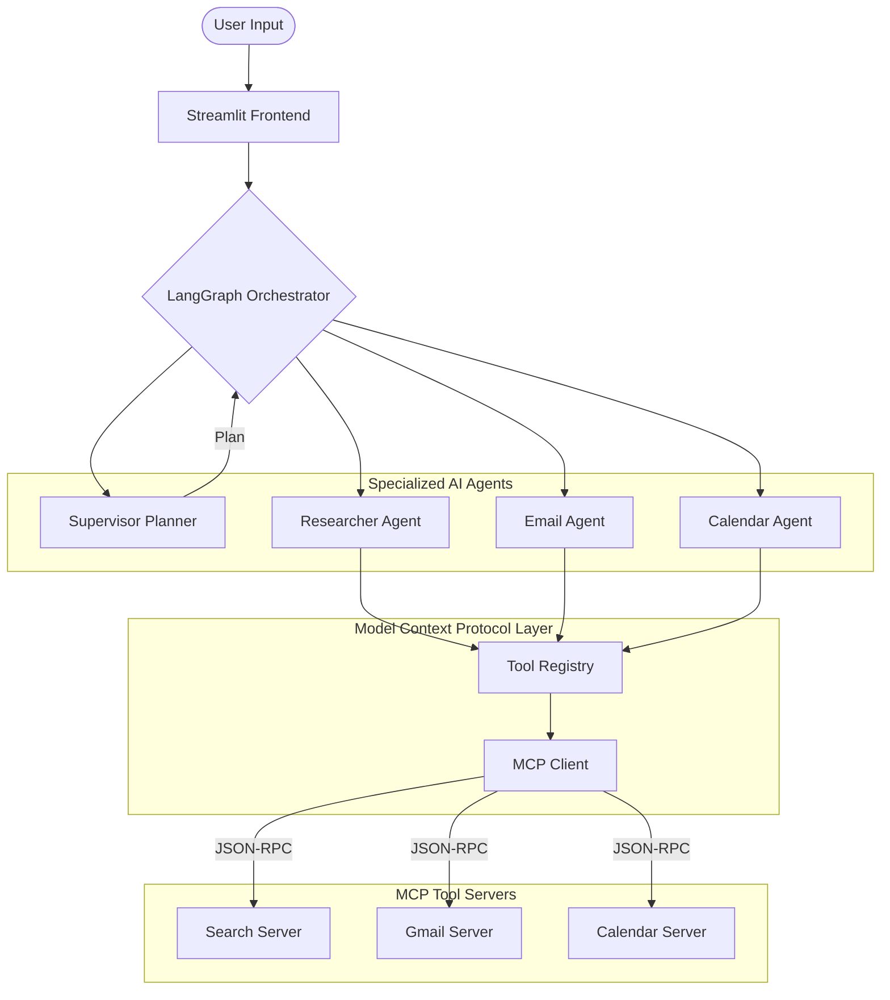

<p align="center">
  
</p>

# 🤖 SwarmAI Assistant
### *Precise • Agentic • Scalable Orchestration*

[](https://www.python.org/downloads/)
[](https://python.langchain.com/docs/langgraph)
[](https://groq.com/)
[](https://render.com/)

SwarmAI is a premium **Multi-Agent Orchestration** system designed for high-performance automation. Built with **LangGraph** and powered by **Groq (Llama-3)**, it utilizes the **Model Context Protocol (MCP)** to separate high-level reasoning from low-level tool execution.

---

## 🏗️ System Architecture

SwarmAI uses a state-of-the-art modular architecture where agents act as modular nodes within a cyclic graph.



---

## 🌟 Key Features

- 🛠️ **Real MCP Integration**: Decoupled tool servers running via standardized JSON-RPC over stdio.
- 📡 **Dynamic Skill Discovery**: Agents scan and register their own capabilities at runtime.
- 🔄 **Cyclic Stateful reasoning**: Managed by LangGraph for robust, multi-hop task completion.
- 📊 **Explainable Intelligence**: Real-time "Control Room" panel in Streamlit displays the agent's internal planning.
- ☁️ **Cloud Native**: Pre-configured for seamless deployment on Render.

---

## 🛠️ Tech Stack

- **Core**: Python 3.11, LangGraph, LangChain
- **LLM**: Groq (Llama-3-70b/8b)
- **Frontend**: Streamlit (Premium UI with Glassmorphism)
- **Tools**: Google Gmail API, Google Calendar API, Tavily Search
- **Deployment**: Render (Web Service Mode)

---

## 🚀 Quick Start

### 1. Prerequisite
Ensure you have `uv` installed:
```bash
curl -LsSf https://astral.sh/uv/install.sh | sh
```

### 2. Installation
Clone the repository and sync dependencies:
```bash
git clone https://github.com/Saurabh14082003/SwarmAI.git
cd SwarmAI
uv sync
```

### 3. Setup Environment
Create a `.env` file and add your keys:
```env
GROQ_API_KEY=your_key_here
TAVILY_API_KEY=your_key_here
```
Place your `credentials.json` from Google Cloud Console in the root directory.

### 4. Run Locally
```bash
uv run streamlit run interface/app.py
```

---

## ☁️ Deploy to Render

This project is optimized for deployment as a Render Web Service.

1. **GitHub**: Push your code to GitHub.
2. **Environment**: Add `GROQ_API_KEY` and `TAVILY_API_KEY` to Render's environment variables.
3. **Secrets**: Upload `credentials.json` and your generated `token.json` as **Secret Files**.
4. **Refer to Docs**: See [AUTH_GUIDE.md](AUTH_GUIDE.md) for detailed headless authentication steps.

---
<p align="center">Built with ❤️ for Scale • Architected for Speed</p>
